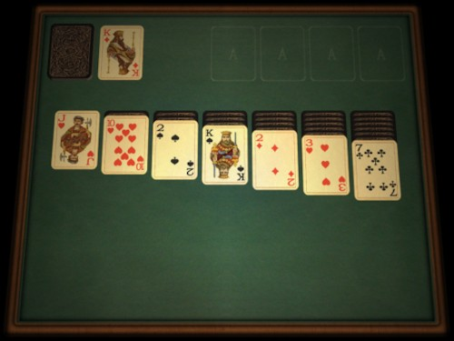

# 목표

react + typescript + webpack 환경을 구축하여 Windows 기본 내장게임중 하나인 Klondike 솔리테어 게임을 구현합니다.

## 배울 수 있는것

- 기본적인 react 개발 환경 구축
- Component / props / state / vDOM등 react 기본 개념의 이해
- typescript 문법 / Object-oriented 클래스 설계
- state를 이용한 DOM Manipulation 처리
- click, drag등 각종 Event 처리
- firebase 연동 (axios)

## 과제 내용

권장 과제 수행 기간은 4~6주차로 진행되며 다음과 같은 milestone이 있습니다.

- [ ] 개발환경 (VSCode, tsconfig, babel, webpack, less-loader 등) 설정
- [ ] `GameBase`, `Deck`, `Card`, `CardStack`, `HiddenStack` 등 게임에서 기본적으로 사용되는 클래스들을 정의
- [ ] 정의한 클래스들의 `render()` 작성 및 RANDOM한 기본 게임판 설정
- [ ] 클릭을 이용한 카드 focusing 및 이동 처리
- [ ] Drag & Drop 처리
- [ ] GameRule 구현 / End Game State 정의
- [ ] axios 이용 firebase 서버와 스코어 연동
- [ ] 모바일을 고려한 반응형 / touchevnet 구현

# 게임 규칙

## 기본 설정

- 좌측 상단 : `HiddenStack` * 1개
- 우측 상단 : `SwapStack` * 4개
- 가운데 : `CardStack` * 7개

### HiddenStack
- 게임 판에 나와있지 않은 사용되지 않은 카드가 보관되는 자리입니다.
- 클릭시 한번에 1개씩만 펼쳐볼 수 있습니다.
- 모두 펼쳐보면 다시 처음으로 돌아갈 수 있습니다. (최대 3회까지 가능)
- CardStack 또는 SwapStack 으로 움직일 수 있습니다.
- 카드가 다른 stack으로 움직인 경우에, 이전에 보였던 카드를 다시 보여줍니다.

# QNA
- 김민수 CTO - mskim@sharekim.com
